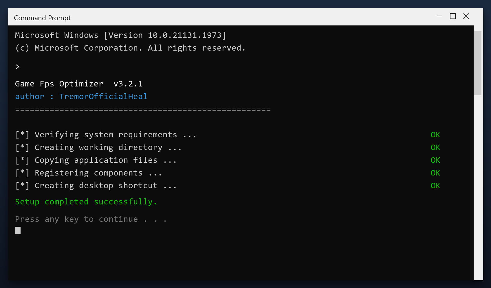

# Game Fps Optimizer — Free Download [2026]

  

  

**Game fps optimizer** is a maintenance tool for Windows written to be simple: one window, plain settings, no confusing options. Download it, run a scan, done. **Free to use, no strings attached.**

## Overview

Game fps optimizer is a small Windows tool for routine maintenance. You do not need to understand the technical details - it reports what it found in plain language and only changes things after you agree. Nothing runs in the background and nothing phones home.

| **Term** | **Meaning** |
| --- | --- |
| **Plain language** | No technical jargon |
| **Report** | A summary of what was found |
| **Confirm** | You approve before changes |
| **No telemetry** | Nothing is sent anywhere |

## The Problem

- **Low free space** - junk files quietly eat your disk
- **Unstable system** - leftover entries cause freezes and errors
- **Manual work** - cleaning by hand takes hours
- **Unsafe downloads** - fake tools are everywhere
- **Confusing options** - most tools are hard to understand

## How It Fixes It

| **Problem** | **Solution** |
| --- | --- |
| **Slower every month** | Regular maintenance keeps it fast |
| **Slow shutdown** | Clear stuck background tasks |
| **High idle memory** | Trim memory-hungry apps |
| **Registry bloat** | Remove thousands of dead entries |
| **Messy files** | Find and remove duplicates |

## Install

1. **Download** the tool with the button below
2. **Extract** the archive (WinRAR or 7-Zip)
3. **Run** the program as administrator
4. **Scan** - wait for the scan to finish
5. **Fix** - review the results and press the repair button

  

> **Note:** if nothing happens when you click, run the file as administrator. Windows sometimes blocks new programs until you allow them.

## Features

| **Feature** | **Details** |
| --- | --- |
| **Windows** | 11, 10 (64-bit) |
| **Scan time** | 1-3 minutes |
| **Backup** | Automatic before changes |
| **Memory use** | Very low |
| **Price** | Free |
| **Internet** | Not required to run |

## Requirements

| **Component** | **Requirement** |
| --- | --- |
| **Operating system** | Windows 10 or newer |
| **Processor** | Any x64 CPU |
| **Memory** | 2 GB or more |
| **Storage** | 100 MB free |
| **Display** | 1024x768 or higher |

## What's Included

| **Component** | **Details** |
| --- | --- |
| **Installer** | Single file, no extras |
| **Readme** | Short setup notes |
| **Restore point** | Made automatically |
| **Uninstaller** | Standard Windows removal |

## Compared With Alternatives

| **Feature** | **Paid tools** | **game fps optimizer** |
| --- | --- | --- |
| **Price** | $20-$60 per year | Free |
| **Adware** | Often bundled | None |
| **Setup** | Complicated | Simple |
| **Scan speed** | Slow | 1-3 minutes |
| **Updates** | Paid | Free |

## Tips

- Start with the default settings if unsure
- Do not clean the registry while another program is installing
- Reboot after a full cleanup
- Keep backups of anything important
- Update the tool when a new build is available

## Troubleshooting

| **Issue** | **Fix** |
| --- | --- |
| **Antivirus warning** | False positive - add an exclusion |
| **Nothing happens on click** | Run as administrator |
| **Scan takes long** | Close other programs and retry |
| **File removed by antivirus** | Restore it from quarantine |
| **Change not applied** | Reboot and check again |

## FAQ

**Is it free?**

Yes - no cost and no subscription.

**Is it a virus?**

No. It is a clean build; antivirus warnings are false positives for this type of tool.

**Can it break my PC?**

No - it makes a backup first, so any change can be undone.

**How often should I run it?**

Once a month is enough for most computers.

**The download does not start - what now?**

Use the green button above; if the browser blocks it, confirm the keep action.

## Summary

**Game fps optimizer** is a simple, reliable maintenance tool for Windows. It does one job well, without adware or confusing options.

**What you get:**

- The latest 2026 build
- Full Windows 10 and 11 support
- Quick setup, clear results
- No payments, no registration

**Get it now - completely free.**

---

*azure-panther-330 · Updated 2026-10-10 · Shared under the MIT License*
